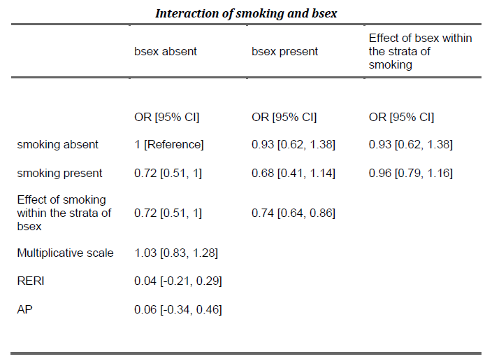
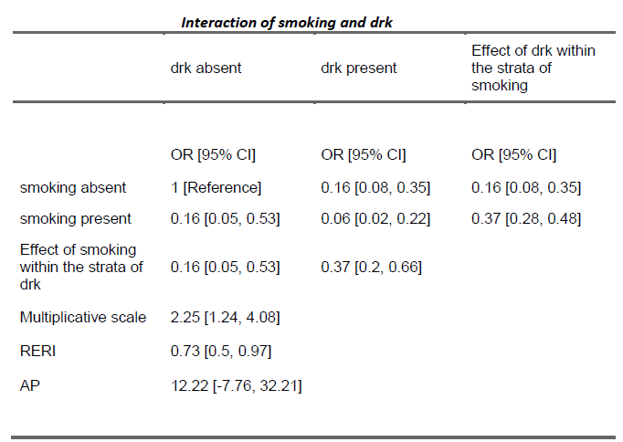

```{r setup, include=FALSE}
knitr::opts_chunk$set(
    echo        = FALSE,
    message     = FALSE,
    warning     = FALSE,
    out.width   = "350px",
    out.height  = "350px",
    fig.pos     = "center",
    fig.align   = "center",
    dpi         = 300, 
    comment     = NA)

```

```{r Libraries}

library(tidyverse)
library(haven)
library(skimr)
library(scales)
library(knitr)
library(tables)
library(stargazer)
library(leaps)
library(MASS)
library(interactionR)
library(equatiomatic)

```

\newpage
# 1. INTRODUCTION

This is an observational cohort study of infants born in the state of Florida in 1993. It is an exploratory epidemiological evaluation of a secondary database merging birth vital statistics (BVS), Florida's Death Data source supplied by the Florida Department of Health, Medicaid eligibility and enrollment data files provided by Florida's Agency of Health Care Administration; Women, Infants, and Children (WIC) Nutritional Supplement Program certification files supplied by the Florida WIC office; and the Florida Healthy Start prenatal risk screen score data file supplied by Florida Department of Health. It contains singletons only.

```{r}

# load the data and skim through
data_tbl <- read_sas("dataset2.sas7bdat")
skim_without_charts(data_tbl)

```

From the tables above, we can see that the dataset comprises of 2553 observations and 12 variables. Where 10 are explanatory variables - smoking, drk, BI, edu, ms, mrace, bsex, kotel, med, momage. Variable “Total” is the total number of infants, while variable “vlbw” is the total number of infants with vlbw and “ideath” is the total number of infants dead within 1st year of his/her life, within the combination of 10 explanatory variables. Your study’s outcome is vlbw.

\newpage
# 2. ANALYSIS

```{r}

factored_data_tbl <- data_tbl %>%
  mutate(
    smoking = case_when(smoking == 1 ~ "Yes",
                        smoking == 2 ~ "No"),
    
    drk     = case_when(drk     == 1 ~ "Yes",
                        drk     == 2 ~ "No"),
    
    BI      = case_when(BI      == 1 ~ "<=15 Months",
                        BI      == 2 ~ "First Birth",
                        BI      == 3 ~ ">15 Months"),
    
    edu     = case_when(edu     == 1 ~ "<HS",
                        edu     == 2 ~ "HS",
                        edu     == 3 ~ ">HS"),
    
    ms      =  case_when(ms     == 1 ~ "No",
                         ms     == 2 ~ "Yes"),
    
    mrace   = case_when(mrace   == 1 ~ "Black",
                        mrace   == 2 ~ "Other",
                        mrace   == 3 ~ "White"),
    
    momage  = case_when(momage  == 1 ~ "<=20",
                        momage  == 2 ~ ">34",
                        momage  == 3 ~ "20-34"),
    
    bsex    = case_when(bsex    == 1 ~ "Male",
                        bsex    == 2 ~ "Female"),
    
    kotel   = case_when(kotel   == 1 ~ "No", 
                        kotel   == 2 ~ "Yes"),
    
    med     = case_when(med     == 1 ~ "Yes",
                        med     == 2 ~ "No")
  )

```

We shall be using this dataset to perform our analysis.\


```{r question 1, results='asis'}

first_data_tbl <- factored_data_tbl %>%
  pivot_longer(!c(total, vlbw), names_to = "factor", values_to = "level") %>%
  dplyr::select(factor, level, everything()) %>%
  group_by(factor, level) %>%
  
  summarise(Obs         = n(),
            total       = sum(total),
            `vlbw Obs`  = sum(vlbw)) %>%
  mutate(`vlbw Perc`    = (`vlbw Obs` / sum(`vlbw Obs`)) * 100) %>%
  arrange(desc(level)) %>%
  ungroup

toLatex(
  tabular(
    RowFactor(factor, spacing = 1) * Factor(level)  ~  (Obs + total + `vlbw Obs` + `vlbw Perc`) * AllObs(first_data_tbl, within = list(factor, level)),
    data  = first_data_tbl
  ),
  options = list(tabular = "longtable",
                 toprule = "\\caption{Sample size and vlbw in each cohort}\\\\
\\toprule")
)
                  
```

\
Table 3 above provides a concise summary of the sample size (total singletons) indicated by Obs, the total number of births, the total number of infants with “vlbw” denoted by vlbw in each cohort and as well as the vlbw percentage. 

\newpage
```{r question 2, results='asis'}

pivoted_data_tbl <- factored_data_tbl %>% 
  pivot_longer(!c(total, vlbw), names_to = "factor", values_to = "level") %>% 
  dplyr::select(factor, level, everything()) %>% 
  group_by(factor, level) %>% 
  summarise(`Number of Births` = sum(total)) %>% 
  ungroup 

toLatex(tabular(RowFactor(factor, spacing = 1)*Factor(level)  ~  `Number of Births` * AllObs(pivoted_data_tbl, within = list(factor, level)), data = pivoted_data_tbl),
        options = list(tabular="longtable",
toprule="\\caption{Table with raw rates by explanatory variables}\\\\
\\toprule"))
          
```

\
Table 4 above shows the raw rates by explanatory variables.

\newpage
Next, we perform our analysis with the 10 explanatory variables and their corresponding two-factor interactions (vlbw and total). We create a logistic regression and apply (stepwise) model selection criterion by entering and removing p-values which are set as 0.05.  We shall then use the Akaike Information Criterion (AIC) to choose the optimal model.

\
\

```{r results='asis'}
# Modelling ----

model_1  <- glm(cbind(vlbw, total)  ~ smoking + drk + BI + edu + ms + mrace + bsex + kotel + med + momage ,family = binomial("logit"), data = data_tbl)
model_2  <- glm(cbind(vlbw, total)  ~ smoking + drk + BI + edu + ms + mrace + bsex + kotel + med  ,family = binomial("logit"), data = data_tbl)
model_3  <- glm(cbind(vlbw, total)  ~ smoking + drk + BI + edu + ms + mrace + bsex + kotel, family = binomial("logit"), data = data_tbl)
model_4  <- glm(cbind(vlbw, total)  ~ smoking + drk + BI + edu + ms + mrace + bsex,family =  binomial("logit"), data = data_tbl)
model_5  <- glm(cbind(vlbw, total)  ~ smoking + drk + BI + edu + ms + mrace, family = binomial("logit"), data = data_tbl)
model_6  <- glm(cbind(vlbw, total)  ~ smoking + drk + BI + edu + ms ,family = binomial("logit"), data = data_tbl)
model_7  <- glm(cbind(vlbw, total)  ~ smoking + drk + BI + edu ,family = binomial("logit"), data = data_tbl)
model_8  <- glm(cbind(vlbw, total)  ~ smoking + drk + BI, family = binomial("logit"), data = data_tbl)
model_9  <- glm(cbind(vlbw, total)  ~ smoking + drk,family = binomial("logit"), data = data_tbl)
model_10 <- glm(cbind(vlbw, total) ~ smoking ,family = binomial("logit"), data = data_tbl)


stargazer(
  model_1,
  model_2,
  model_3,
  model_4,
  model_5, 
  
  title = "Logistic Regression Models Comparisons",
  column.labels = c(
    "Model 1",
    "Model 2",
    "Model 3",
    "Model 4",
    "Model 5"
  ),

  
  omit.stat = c("rsq", "f"),
  notes.align = "l",
  header = FALSE,
  no.space = TRUE,
  column.sep.width = "3pt",
  font.size = "small", float = FALSE
)

```


```{r results='asis'}

stargazer(
  model_6,
  model_7,
  model_8,
  model_9,
  model_10,
  title = "Logistic Regression Models Comparisons",
  column.labels = c(
    "Model 6",
    "Model 7",
    "Model 8",
    "Model 9",
    "Model 10"
  ),

  
  omit.stat        = c("rsq", "f"),
  notes.align      = "l",
  header           = FALSE,
  no.space         = TRUE,
  column.sep.width = "3pt",
  font.size        = "small",
  float            = FALSE
)

```
\
From the Logistic regression models comparisons above, we can clearly see that model 5 had the least AIC of 3450.0065 while model 10 had the highest AIC of 4,107.181. Therefore, here we choose model 5.


```{r results='asis'}

step_model <- stepAIC(model_1, trace = FALSE)
stargazer(
  step_model,
  title         = "Best Model",
  column.labels = c(
   "Model"
  ),

  
  omit.stat        = c("rsq", "f"),
  notes.align      = "l",
  header           = FALSE,
  no.space         = TRUE,
  column.sep.width = "3pt",
  font.size        = "small", float = FALSE
)

```


However, after conducting further analysis we find a model that is more optimal with a lower AIC of 3446.531. The table above shows the optimal model's variables, the estimates and standard errors.

We then proceed to get the adjusted main odds ratio of our best model.

```{r question 4}

lower_conf_func <- function(estimate, std.error) {
  return(exp(estimate - 1.96 * std.error))
}

upper_conf_func <- function(estimate, std.error) {
  return(exp(estimate + 1.96 * std.error))
}

best_model_tbl <- broom::tidy(step_model) %>% 
  mutate(odd_ratio     = estimate %>% map(exp) %>% unlist,
         lower_conf    = map2(.x = estimate, .y = std.error, .f = lower_conf_func) %>% unlist ,
         upper_confint = map2(.x = estimate, .y = std.error, .f = upper_conf_func) %>% unlist) 

best_model_tbl %>% knitr::kable(caption = "Adjusted Main Odds Ratios and CI") 

```

Table 5 above shows the variables, estimates, standard error, statistic, p-value, odd_ratio, and the 95% confidence interval of the odds ratios. We can clearly see that the odds ratio confidence intervals contain 0 except for momage whose confidence interval includes 1. Therefore, this confirms an association among the variables.

Next, we go ahead and make a table with adjusted odds ratios for interactions between smoking and the sex of the baby, and interaction between smoking and drinking. Then create a 95% confidence interval for the odds ratios. 

```{r question 5}

# Interaction ----
interaction_model_bsex <-
  glm(cbind(vlbw, total)  ~ smoking * bsex,
      family = binomial("logit"),
      data   = data_tbl)

table_bsex_obj <-
  interactionR(
    interaction_model_bsex,
    exposure_names = c("smoking", "bsex"),
    ci.type        = "delta",
    ci.level       = 0.95,
    em             = F,
    recode         = F
  )

# run this code for the same result
# interactionR_table(table_bsex_obj)



```

Based on the various odd-ratio 95% confidence intervals of interaction between smoking and sex of  baby, we can clearly see that the confidence intervals contain 1, in which we strongly fail to reject the null hypothesis. Hence, we conclude that smoking and whether the sex of the baby is male or female are independent of each other.

```{r question6}

interaction_model_drk <-
  glm(cbind(vlbw, total)  ~ smoking * drk,
      family = binomial("logit"),
      data   = data_tbl)

table_drk_obj <-
  interactionR(
    interaction_model_drk,
    exposure_names = c("smoking", "drk"),
    ci.type        = "delta",
    ci.level       = 0.95,
    em             = F,
    recode         = F
  )

# run this code for the same result
# interactionR_table(table_drk_obj)




```

On the other hand, the odd-ratio 95% confidence intervals between smoking and drinking do not contain 1; therefore, we reject the null hypothesis. Hence, we conclude that there is an association between smoking and whether drinking is present or absent.

# 3. CONCLUSION

From the analysis, we were able to find a suitable model that would help us predict whether or not an infant will have "vblw". The model's equation is as shown below: 
$$\operatorname{vblw|total} =  -0.680 - 0.362(\operatorname{Smoking}) - 0.585(\operatorname{drk}) - 0.105(\operatorname{BI}) - 0.359(\operatorname{ms}) - 0.445(\operatorname{mrace}) - 0.054(\operatorname{momage})$$
We also found out that smoking and drinking during the pregnancy stage were highly associated and had a significant impact as to whether the child would be born with "vblw." In comparison, the interaction between smoking and the sex of the baby had no effect on the infant. In further research, we may investigate how the impact of the interaction between the mother's race and adequate prenatal care determines whether the child will be born with "vblw" or not.

\newpage
# 4. REFERENCES

Wu, Samuel S., et al. "Risk factors for infant maltreatment: a population-based study." Child abuse & neglect 28.12 (2004): 1253-1264.

Agresti, Alan. Categorical data analysis. John Wiley & Sons, 2003.


